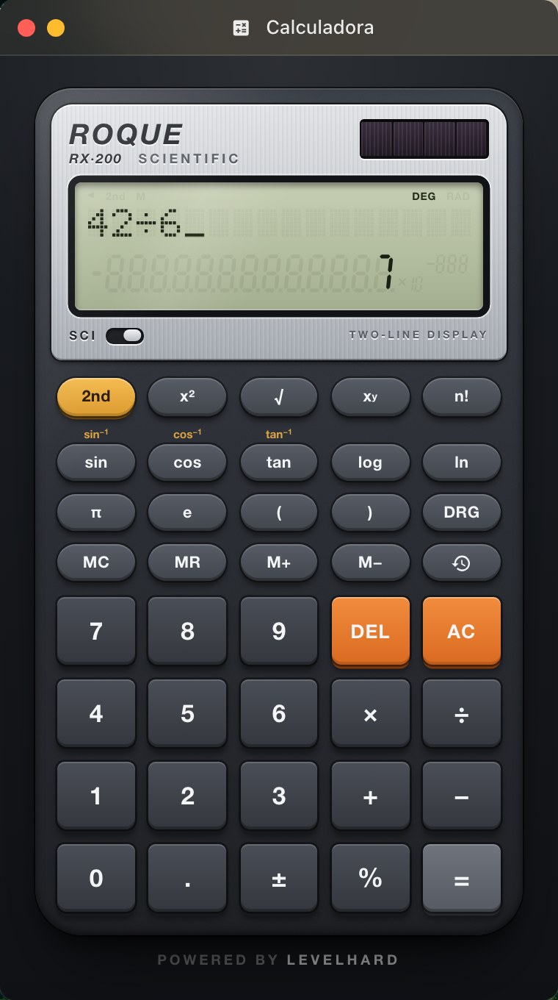
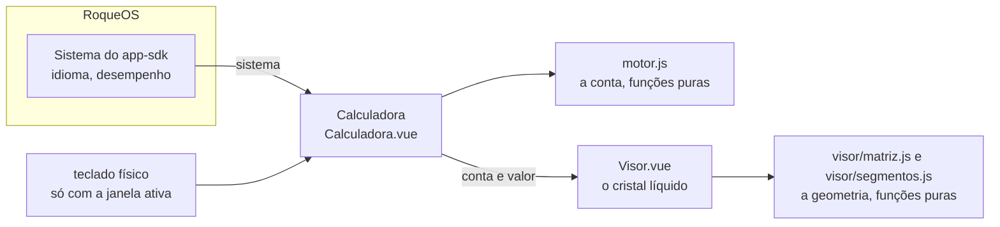

# Calculadora

A calculadora científica do [RoqueOS](https://roqueos.com.br): quatro operações com
precedência, potência, raiz, fatorial, porcentagem, trigonometria em graus ou radianos,
logaritmos, memória (MC, MR, M+, M−) e histórico. Tem a cara de uma calculadora de engenharia
dos anos 2000: visor de cristal líquido de duas linhas (a conta em matriz de pontos, o valor em
sete segmentos), painel de alumínio escovado, células solares e teclas que afundam. Aceita o
teclado físico quando a janela está ativa, e a carcaça pega a luz conforme o aparelho inclina
(ou o ponteiro passa), a não ser que o sistema peça o perfil leve. Nos dez idiomas do RoqueOS.

Use de graça em [roqueos.com.br](https://roqueos.com.br), no computador, no celular e na TV.



_English below._

## Por que existe como repo

A Calculadora nasceu dentro do RoqueOS, que é fechado. Em 27/09/2026 ela foi o primeiro app a
sair para o próprio repositório, aberto sob MIT, na organização
[roqueos-apps](https://github.com/roqueos-apps). O RoqueOS a instala por uma tag, como
dependência git, e ela fala com ele só pelo
[`app-sdk`](https://github.com/roqueos-apps/app-sdk). O mesmo código roda dentro do RoqueOS,
sozinho no navegador (`yarn dev`) e no teste, sem saber em qual dos três está.

## Arquitetura



```text
app.json            quem ela é: id permanente (calculator), nome e descrição nos dez idiomas,
                    ícone, cor, categoria e o tamanho da janela
i18n/<idioma>.json  os textos da tela, um arquivo por idioma
src/
  index.js          definirApp: cria o app Vue próprio dentro do elemento que o RoqueOS dá
  Calculadora.vue   a carcaça, o teclado, a entrada e o histórico
  Visor.vue         o visor de duas linhas: indicadores, matriz de pontos e sete segmentos
  visor/matriz.js   a fonte 5 × 7 desenhada aqui e o recorte da linha de cima
  visor/segmentos.js os sete segmentos: o texto do motor nas células e a geometria
  motor.js          a conta: fichas, notação polonesa reversa e avaliação, funções puras
  textos.js         carrega o JSON do idioma (com ?raw) e traduz uma chave
  useInclinacao.js  o reflexo que segue o sensor ou o ponteiro
  calculadora.scss  a carcaça e as teclas, tudo em cqw da carcaça
  visor.scss        o cristal líquido
dev/main.js         o yarn dev: a Calculadora numa janela falsa do RoqueOS
test/               Vitest: a tela, o visor, as duas geometrias, o app pelo SDK, a troca de
                    idioma, o motor e o reflexo
```

### O visor

Como o de uma calculadora de verdade, o desenho do visor é fixo: dezesseis caracteres de 5 × 7
pontos em cima e, embaixo, o sinal à parte, treze células de sete segmentos e o expoente
pequeno de três dígitos com o "×10". Treze células porque é o que o `fmt` do motor escreve de
mais comprido ("0." e doze casas); nada encolhe e nada corta. O que está apagado fica
fantasma, fraco, como no cristal líquido, e a conta longa mostra o fim, com a seta ◀ acesa. O
texto de verdade das duas linhas fica legível para o leitor de tela e para os testes; o
desenho é SVG, sem fonte de arquivo.

### Como ela fala com o RoqueOS

Só pelo `sistema` do SDK:

- `idioma`: o texto desce no idioma de quem usa e troca com a janela aberta (a última troca
  pedida vence);
- `desempenho.modoLeve()`: no aparelho fraco não ligam o reflexo, o grão, a textura escovada
  nem o cursor piscando;
- `ativar(ativo)` da montagem: o teclado físico só vale com a janela ativa.

Ela não grava nada, não fala com servidor nem com banco, e não pede capacidade opcional. Não
lê cor do tema do RoqueOS: é um objeto, igual no tema claro e no escuro, e as cores dela são
`--calc-*`, dela.

## Pré-requisitos

- Node 22 ou mais novo (o `.nvmrc` diz 24).
- Yarn 1.22.

## Como rodar

```bash
yarn install --ignore-scripts
yarn dev          # a Calculadora numa janela falsa do RoqueOS, com o seletor dos dez idiomas
yarn verificar    # lint, formato, testes e app check: o mesmo do CI e do pre-push
yarn test         # só os testes
```

Na janela do `yarn dev`, `?idioma=ar-AR` abre em árabe (da direita para a esquerda) e
`?leve=1` mostra o app como o aparelho fraco vê.

## Paridade com o app de antes

`paridade.json` é o inventário do que a Calculadora fazia dentro do RoqueOS e do que aconteceu com
cada coisa na saída: `mantida`, `mudou` (com a nota do que mudou) ou `perdida` (só com a
decisão escrita de quem decidiu). Cada item cita o teste deste repo que o prova, ou a
evidência. O RoqueOS confere o arquivo no pacote instalado antes de aceitar a versão: teste
citado que não existe mais, estado de dúvida ou perda sem decisão reprovam. Mudou uma
funcionalidade, ou um teste citado ali? Atualize o inventário no mesmo commit.

## Contribuir

Leia o [CONTRIBUTING.md](CONTRIBUTING.md). Todo commit leva `Signed-off-by` (DCO), e o CI
confere. Falha de segurança vai pelo [SECURITY.md](SECURITY.md), nunca por issue pública.

## Créditos e licença

[MIT](LICENSE). O ícone do histórico é o `history` do
[Material Icons](https://fonts.google.com/icons), sob Apache-2.0, desenhado inline em
`Calculadora.vue` (veja o [ASSETS.md](ASSETS.md)). O nome e a marca RoqueOS são da LEVELHARD
e não fazem parte da licença.

---

## English

The scientific calculator of [RoqueOS](https://roqueos.com.br): the four operations with
precedence, powers, roots, factorial, percent, trigonometry in degrees or radians, logarithms,
memory and history, in all ten RoqueOS languages. It looks like a 2000s engineering
calculator: a two-line liquid crystal display (the expression in a dot matrix, the value in
seven segments, with the ghost of the unlit segments), a brushed aluminium panel, solar cells
and keys that sink when pressed, all drawn in SVG and CSS with no image or font file. It
accepts the physical keyboard while its window is active, and its case catches the light as
the device tilts (or the pointer moves), unless the system asks for the light profile.

It was born inside RoqueOS, which is closed source, and on 27/09/2026 became the first app to
move to its own open repository under MIT, in the
[roqueos-apps](https://github.com/roqueos-apps) organization. RoqueOS installs it by tag as a
git dependency, and it talks to RoqueOS only through the `sistema` of
[`@roqueos-apps/app-sdk`](https://github.com/roqueos-apps/app-sdk) (language, light profile,
active window). It stores nothing, calls no server or database, and reads no color from the
RoqueOS theme.

Run `yarn install --ignore-scripts`, then `yarn dev` to open it in a fake RoqueOS window with
a language picker, or `yarn verificar` to run what CI runs. Every commit must be signed off
(DCO). Licensed under [MIT](LICENSE); the history icon is Material Icons `history`
(Apache-2.0), drawn inline. The RoqueOS name and brand belong to LEVELHARD and are not covered.

`paridade.json` lists everything this app did inside the RoqueOS core and what happened to each
item when it moved out (kept, changed with a note, or lost only with a written decision), each
backed by a test in this repository or other evidence. RoqueOS checks it in the installed
package before accepting a version.
